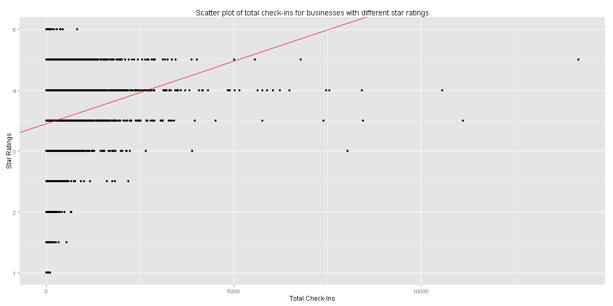
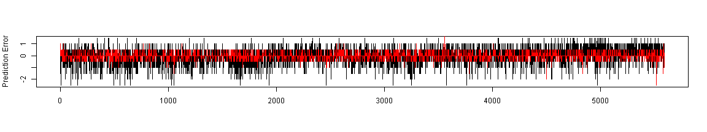

Check-Ins vs. Review Score Relationship in Yelp Data Set
========================================================
author: Ernest Kurniawan
date: 22 November 2015
transition: rotate
  
<br>
  
<small>
Course assignment for Coursera  
**Capstone Project**  
Part of Data Science Specialization series.
</small>

Motivation
========================================================

A good review in Yelp is expected to promote the fact that a particular business is good, and therefore will attract more customers to engage the business, which will in turn generate a large number of check-ins. 

The motivation of this work is to show the relationship between the review score that a business receive and the total number of check-ins that it generates.

By analyzing the Yelp data set, we first show this relationship, and build a simple model to corroborate this fact. Then we proceed on building a prediction model to estimate the business ratings based on the check-ins data and other relevant information. Finally, the prediction performance is evaluated through cross validation.


Prediction Method
========================================================

In order to show the relationship between star ratings and the total check-ins, we show the scatter plot together with the simple linear model relating the two.
 


Prediction Method (Continued)
========================================================

Two models are then created, one using a simple linear model, and another using random forest model.

```r
MyModel1 <- lm(stars~totCheckIn, data=CheckinDF[inTrain,])
MyModel2 <- train(starsFactor~., data=CheckinDF[inTrain, -c(1,2,3)], method = "rf", ntree=100)
```
After cross validation, the prediction errors of both models are respectively shown in the black and red curves below.
 

Results and Discussions
========================================================

- We have shown the positive correlation between review ratings and total check-ins, which holds except for the ratings above 4 stars.
- Using linear model and random forest, we build a prediction model for the ratings using total check-ins and other information to achieve prediction error of 0.7105546 for the linear model, and 0.2178891 for the random forest.
- We believe by including other factors such as the social connectivity of the reviewer, and taking into consideration the number of businesses from a particular rating group, we are able to improve the prediction accuracy.
